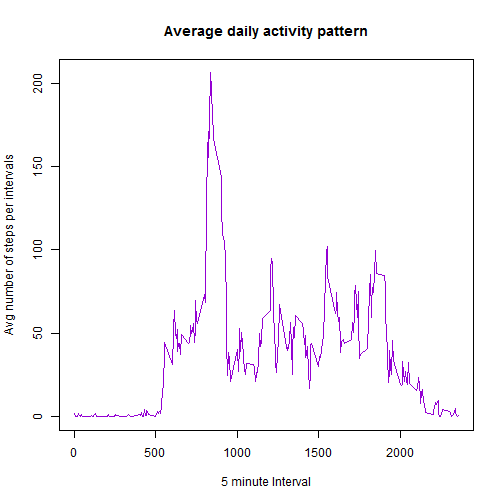
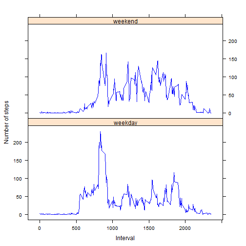

Reproducible Research: Peer Assessment 1
========================================

Rahul Janardan


## Overview

This analysis makes use of data from a personal activity monitoring device. This device collects data at 5 minute intervals through out the day. The data consists of two months of data from an anonymous individual collected during the months of October and November, 2012 and include the number of steps taken in 5 minute intervals each day.

## Data
  
The data for this assignment can be downloaded from the following link:
al 
[Download Activity monitoring data](https://d396qusza40orc.cloudfront.net/repdata%2Fdata%2Factivity.zip)


The variables included in this dataset are:

1. steps: Number of steps taking in a 5-minute interval (missing values are coded as NA)
2. date: The date on which the measurement was taken in YYYY-MM-DD format
3. interval: Identifier for the 5-minute interval in which measurement was taken


The dataset is stored in a comma-separated-value (CSV) file and there are a total of 17,568 observations in this dataset.

## Loading the data


```r
data <- read.csv("activity.csv")
```
## What is mean total number of steps taken per day?

For this analysis, we follow the below steps:

1. Summarise data for total number of steps per day
2. Plot histogram using the total values from above summary.
3. Calculate the mean and median of the total number of steps taken per day. 

It is to be noted that

* The *plyr* package is being used.
* For this analysis we will ignore the NA rows by using the na.omit function
* **Dates with NA rows are ignored** for mean and median calculations and the result is displayed in a table.


```r
if(!require(plyr)){
  install.packages("plyr")
  require(plyr)
}
```

```
## Loading required package: plyr
```

```r
dataNoNA <- na.omit(ddply(data,"date", summarise,total = sum(steps)))
hist(dataNoNA$total,main = "Histogram of total number of steps per day",xlab = "Values", ylim = c(0,30),col = "dark red")
```

 

**Mean and Median calculations.**

```r
summData <- na.omit(ddply(data,"date", summarise,Mean = mean(steps,na.rm = TRUE), Median = median(steps,na.rm = TRUE)))
kable(summData,format = "markdown")
```

```
## 
## 
## |   |date       |    Mean| Median|
## |:--|:----------|-------:|------:|
## |2  |2012-10-02 |  0.4375|      0|
## |3  |2012-10-03 | 39.4167|      0|
## |4  |2012-10-04 | 42.0694|      0|
## |5  |2012-10-05 | 46.1597|      0|
## |6  |2012-10-06 | 53.5417|      0|
## |7  |2012-10-07 | 38.2465|      0|
## |9  |2012-10-09 | 44.4826|      0|
## |10 |2012-10-10 | 34.3750|      0|
## |11 |2012-10-11 | 35.7778|      0|
## |12 |2012-10-12 | 60.3542|      0|
## |13 |2012-10-13 | 43.1458|      0|
## |14 |2012-10-14 | 52.4236|      0|
## |15 |2012-10-15 | 35.2049|      0|
## |16 |2012-10-16 | 52.3750|      0|
## |17 |2012-10-17 | 46.7083|      0|
## |18 |2012-10-18 | 34.9167|      0|
## |19 |2012-10-19 | 41.0729|      0|
## |20 |2012-10-20 | 36.0938|      0|
## |21 |2012-10-21 | 30.6285|      0|
## |22 |2012-10-22 | 46.7361|      0|
## |23 |2012-10-23 | 30.9653|      0|
## |24 |2012-10-24 | 29.0104|      0|
## |25 |2012-10-25 |  8.6528|      0|
## |26 |2012-10-26 | 23.5347|      0|
## |27 |2012-10-27 | 35.1354|      0|
## |28 |2012-10-28 | 39.7847|      0|
## |29 |2012-10-29 | 17.4236|      0|
## |30 |2012-10-30 | 34.0938|      0|
## |31 |2012-10-31 | 53.5208|      0|
## |33 |2012-11-02 | 36.8056|      0|
## |34 |2012-11-03 | 36.7049|      0|
## |36 |2012-11-05 | 36.2465|      0|
## |37 |2012-11-06 | 28.9375|      0|
## |38 |2012-11-07 | 44.7326|      0|
## |39 |2012-11-08 | 11.1771|      0|
## |42 |2012-11-11 | 43.7778|      0|
## |43 |2012-11-12 | 37.3785|      0|
## |44 |2012-11-13 | 25.4722|      0|
## |46 |2012-11-15 |  0.1424|      0|
## |47 |2012-11-16 | 18.8924|      0|
## |48 |2012-11-17 | 49.7882|      0|
## |49 |2012-11-18 | 52.4653|      0|
## |50 |2012-11-19 | 30.6979|      0|
## |51 |2012-11-20 | 15.5278|      0|
## |52 |2012-11-21 | 44.3993|      0|
## |53 |2012-11-22 | 70.9271|      0|
## |54 |2012-11-23 | 73.5903|      0|
## |55 |2012-11-24 | 50.2708|      0|
## |56 |2012-11-25 | 41.0903|      0|
## |57 |2012-11-26 | 38.7569|      0|
## |58 |2012-11-27 | 47.3819|      0|
## |59 |2012-11-28 | 35.3576|      0|
## |60 |2012-11-29 | 24.4688|      0|
```
## What is the average daily activity pattern?

**Summarise the data according to the 5 minute intervals and generate a time series plot.**

```r
avgDap <- ddply(data,.(interval), summarise,Mean = mean(steps,na.rm = TRUE))
plot(avgDap[[1]],avgDap[[2]],type = "l", 
     xlab = "5 minute Interval", 
     ylab = "Avg number of steps per intervals", 
     main = "Average daily activity pattern",
     col = "darkviolet")
```

 

**Report the 5-minute interval that, on average, contains the maximum number of steps**

```
The 5-minute interval that, on average, contains the maximum number of steps is 835.
```


## Imputing missing values

**Reporting missing values in the data set**
```
The total number of missing values in the data set is 2304.
```
**Strategy for filling in missing values in the data set.**

The mean or median for a day may not be a good choice to replace as some days have completely NA filled in. A better approach would be to use the mean for that particular 5 minute interval.

Steps are as follows: 

1. Merge the raw data(stored in *data* data frame) with the *avgDap* data frame which has the interval-wise means. 
2. Since *merge* messes with the order of the list we will also reorder as per the date.
3. Now we use the *Mean*(of steps/interval) column to replace the NA values in the *steps* column. 


```r
newData <- merge(data,avgDap,all.x = TRUE, sort = FALSE)
newData <- newData[order(newData$date),]
for(i in 1:length(newData$steps)){
    if(is.na(newData[i,2]))
      newData[i,2] <- newData[i,4]
}
```
**New data set with missing data filled in**

```r
newData <- newData[c(2,3,1)]
```

The **first 50 rows (ONLY)** of the new data set is as below: 


```r
kable(head(newData,50))
```

```
## 
## 
## |     |  steps|date       | interval|
## |:----|------:|:----------|--------:|
## |1    | 1.7170|2012-10-01 |        0|
## |63   | 0.3396|2012-10-01 |        5|
## |128  | 0.1321|2012-10-01 |       10|
## |205  | 0.1509|2012-10-01 |       15|
## |264  | 0.0755|2012-10-01 |       20|
## |327  | 2.0943|2012-10-01 |       25|
## |376  | 0.5283|2012-10-01 |       30|
## |481  | 0.8679|2012-10-01 |       35|
## |495  | 0.0000|2012-10-01 |       40|
## |552  | 1.4717|2012-10-01 |       45|
## |620  | 0.3019|2012-10-01 |       50|
## |716  | 0.1321|2012-10-01 |       55|
## |770  | 0.3208|2012-10-01 |      100|
## |840  | 0.6792|2012-10-01 |      105|
## |880  | 0.1509|2012-10-01 |      110|
## |924  | 0.3396|2012-10-01 |      115|
## |1018 | 0.0000|2012-10-01 |      120|
## |1097 | 1.1132|2012-10-01 |      125|
## |1141 | 1.8302|2012-10-01 |      130|
## |1183 | 0.1698|2012-10-01 |      135|
## |1230 | 0.1698|2012-10-01 |      140|
## |1320 | 0.3774|2012-10-01 |      145|
## |1388 | 0.2642|2012-10-01 |      150|
## |1443 | 0.0000|2012-10-01 |      155|
## |1507 | 0.0000|2012-10-01 |      200|
## |1547 | 0.0000|2012-10-01 |      205|
## |1630 | 1.1321|2012-10-01 |      210|
## |1690 | 0.0000|2012-10-01 |      215|
## |1731 | 0.0000|2012-10-01 |      220|
## |1774 | 0.1321|2012-10-01 |      225|
## |1882 | 0.0000|2012-10-01 |      230|
## |1946 | 0.2264|2012-10-01 |      235|
## |2000 | 0.0000|2012-10-01 |      240|
## |2048 | 0.0000|2012-10-01 |      245|
## |2130 | 1.5472|2012-10-01 |      250|
## |2179 | 0.9434|2012-10-01 |      255|
## |2224 | 0.0000|2012-10-01 |      300|
## |2280 | 0.0000|2012-10-01 |      305|
## |2349 | 0.0000|2012-10-01 |      310|
## |2405 | 0.0000|2012-10-01 |      315|
## |2444 | 0.2075|2012-10-01 |      320|
## |2550 | 0.6226|2012-10-01 |      325|
## |2581 | 1.6226|2012-10-01 |      330|
## |2675 | 0.5849|2012-10-01 |      335|
## |2720 | 0.4906|2012-10-01 |      340|
## |2788 | 0.0755|2012-10-01 |      345|
## |2856 | 0.0000|2012-10-01 |      350|
## |2898 | 0.0000|2012-10-01 |      355|
## |2942 | 1.1887|2012-10-01 |      400|
## |3018 | 0.9434|2012-10-01 |      405|
```
**Comparison of new data with original data for analysis**

First we will make a histogram after calculating the total number of steps using the new data. 

```r
newDataWithTotal <- ddply(newData,"date", summarise,total = sum(steps))
hist(newDataWithTotal$total,main = "Histogram of total number of steps per day(new Data)",xlab = "Values", ylim = c(0,40),col = "mediumspringgreen")
```

 

Now we will calculate the mean and median values using the new data set

```r
summNewData <- ddply(newData,"date", summarise,Mean = mean(steps), Median = median(steps))
kable(summNewData,format = "markdown")
```

```
## 
## 
## |date       |    Mean| Median|
## |:----------|-------:|------:|
## |2012-10-01 | 37.3826|  34.11|
## |2012-10-02 |  0.4375|   0.00|
## |2012-10-03 | 39.4167|   0.00|
## |2012-10-04 | 42.0694|   0.00|
## |2012-10-05 | 46.1597|   0.00|
## |2012-10-06 | 53.5417|   0.00|
## |2012-10-07 | 38.2465|   0.00|
## |2012-10-08 | 37.3826|  34.11|
## |2012-10-09 | 44.4826|   0.00|
## |2012-10-10 | 34.3750|   0.00|
## |2012-10-11 | 35.7778|   0.00|
## |2012-10-12 | 60.3542|   0.00|
## |2012-10-13 | 43.1458|   0.00|
## |2012-10-14 | 52.4236|   0.00|
## |2012-10-15 | 35.2049|   0.00|
## |2012-10-16 | 52.3750|   0.00|
## |2012-10-17 | 46.7083|   0.00|
## |2012-10-18 | 34.9167|   0.00|
## |2012-10-19 | 41.0729|   0.00|
## |2012-10-20 | 36.0938|   0.00|
## |2012-10-21 | 30.6285|   0.00|
## |2012-10-22 | 46.7361|   0.00|
## |2012-10-23 | 30.9653|   0.00|
## |2012-10-24 | 29.0104|   0.00|
## |2012-10-25 |  8.6528|   0.00|
## |2012-10-26 | 23.5347|   0.00|
## |2012-10-27 | 35.1354|   0.00|
## |2012-10-28 | 39.7847|   0.00|
## |2012-10-29 | 17.4236|   0.00|
## |2012-10-30 | 34.0938|   0.00|
## |2012-10-31 | 53.5208|   0.00|
## |2012-11-01 | 37.3826|  34.11|
## |2012-11-02 | 36.8056|   0.00|
## |2012-11-03 | 36.7049|   0.00|
## |2012-11-04 | 37.3826|  34.11|
## |2012-11-05 | 36.2465|   0.00|
## |2012-11-06 | 28.9375|   0.00|
## |2012-11-07 | 44.7326|   0.00|
## |2012-11-08 | 11.1771|   0.00|
## |2012-11-09 | 37.3826|  34.11|
## |2012-11-10 | 37.3826|  34.11|
## |2012-11-11 | 43.7778|   0.00|
## |2012-11-12 | 37.3785|   0.00|
## |2012-11-13 | 25.4722|   0.00|
## |2012-11-14 | 37.3826|  34.11|
## |2012-11-15 |  0.1424|   0.00|
## |2012-11-16 | 18.8924|   0.00|
## |2012-11-17 | 49.7882|   0.00|
## |2012-11-18 | 52.4653|   0.00|
## |2012-11-19 | 30.6979|   0.00|
## |2012-11-20 | 15.5278|   0.00|
## |2012-11-21 | 44.3993|   0.00|
## |2012-11-22 | 70.9271|   0.00|
## |2012-11-23 | 73.5903|   0.00|
## |2012-11-24 | 50.2708|   0.00|
## |2012-11-25 | 41.0903|   0.00|
## |2012-11-26 | 38.7569|   0.00|
## |2012-11-27 | 47.3819|   0.00|
## |2012-11-28 | 35.3576|   0.00|
## |2012-11-29 | 24.4688|   0.00|
## |2012-11-30 | 37.3826|  34.11|
```

**Comparison of Mean Median results with that obtained from raw Data.**

**The below call to *kable* function may give an error due to a bug in older versions. Please make sure that you have the latest version of *knitr* installed.** 


```r
kable(merge(summData,summNewData,by = "date",all.y = TRUE ))
```

```
## 
## 
## |date       |  Mean.x| Median.x|  Mean.y| Median.y|
## |:----------|-------:|--------:|-------:|--------:|
## |2012-10-01 |      NA|       NA| 37.3826|    34.11|
## |2012-10-02 |  0.4375|        0|  0.4375|     0.00|
## |2012-10-03 | 39.4167|        0| 39.4167|     0.00|
## |2012-10-04 | 42.0694|        0| 42.0694|     0.00|
## |2012-10-05 | 46.1597|        0| 46.1597|     0.00|
## |2012-10-06 | 53.5417|        0| 53.5417|     0.00|
## |2012-10-07 | 38.2465|        0| 38.2465|     0.00|
## |2012-10-08 |      NA|       NA| 37.3826|    34.11|
## |2012-10-09 | 44.4826|        0| 44.4826|     0.00|
## |2012-10-10 | 34.3750|        0| 34.3750|     0.00|
## |2012-10-11 | 35.7778|        0| 35.7778|     0.00|
## |2012-10-12 | 60.3542|        0| 60.3542|     0.00|
## |2012-10-13 | 43.1458|        0| 43.1458|     0.00|
## |2012-10-14 | 52.4236|        0| 52.4236|     0.00|
## |2012-10-15 | 35.2049|        0| 35.2049|     0.00|
## |2012-10-16 | 52.3750|        0| 52.3750|     0.00|
## |2012-10-17 | 46.7083|        0| 46.7083|     0.00|
## |2012-10-18 | 34.9167|        0| 34.9167|     0.00|
## |2012-10-19 | 41.0729|        0| 41.0729|     0.00|
## |2012-10-20 | 36.0938|        0| 36.0938|     0.00|
## |2012-10-21 | 30.6285|        0| 30.6285|     0.00|
## |2012-10-22 | 46.7361|        0| 46.7361|     0.00|
## |2012-10-23 | 30.9653|        0| 30.9653|     0.00|
## |2012-10-24 | 29.0104|        0| 29.0104|     0.00|
## |2012-10-25 |  8.6528|        0|  8.6528|     0.00|
## |2012-10-26 | 23.5347|        0| 23.5347|     0.00|
## |2012-10-27 | 35.1354|        0| 35.1354|     0.00|
## |2012-10-28 | 39.7847|        0| 39.7847|     0.00|
## |2012-10-29 | 17.4236|        0| 17.4236|     0.00|
## |2012-10-30 | 34.0938|        0| 34.0938|     0.00|
## |2012-10-31 | 53.5208|        0| 53.5208|     0.00|
## |2012-11-01 |      NA|       NA| 37.3826|    34.11|
## |2012-11-02 | 36.8056|        0| 36.8056|     0.00|
## |2012-11-03 | 36.7049|        0| 36.7049|     0.00|
## |2012-11-04 |      NA|       NA| 37.3826|    34.11|
## |2012-11-05 | 36.2465|        0| 36.2465|     0.00|
## |2012-11-06 | 28.9375|        0| 28.9375|     0.00|
## |2012-11-07 | 44.7326|        0| 44.7326|     0.00|
## |2012-11-08 | 11.1771|        0| 11.1771|     0.00|
## |2012-11-09 |      NA|       NA| 37.3826|    34.11|
## |2012-11-10 |      NA|       NA| 37.3826|    34.11|
## |2012-11-11 | 43.7778|        0| 43.7778|     0.00|
## |2012-11-12 | 37.3785|        0| 37.3785|     0.00|
## |2012-11-13 | 25.4722|        0| 25.4722|     0.00|
## |2012-11-14 |      NA|       NA| 37.3826|    34.11|
## |2012-11-15 |  0.1424|        0|  0.1424|     0.00|
## |2012-11-16 | 18.8924|        0| 18.8924|     0.00|
## |2012-11-17 | 49.7882|        0| 49.7882|     0.00|
## |2012-11-18 | 52.4653|        0| 52.4653|     0.00|
## |2012-11-19 | 30.6979|        0| 30.6979|     0.00|
## |2012-11-20 | 15.5278|        0| 15.5278|     0.00|
## |2012-11-21 | 44.3993|        0| 44.3993|     0.00|
## |2012-11-22 | 70.9271|        0| 70.9271|     0.00|
## |2012-11-23 | 73.5903|        0| 73.5903|     0.00|
## |2012-11-24 | 50.2708|        0| 50.2708|     0.00|
## |2012-11-25 | 41.0903|        0| 41.0903|     0.00|
## |2012-11-26 | 38.7569|        0| 38.7569|     0.00|
## |2012-11-27 | 47.3819|        0| 47.3819|     0.00|
## |2012-11-28 | 35.3576|        0| 35.3576|     0.00|
## |2012-11-29 | 24.4688|        0| 24.4688|     0.00|
## |2012-11-30 |      NA|       NA| 37.3826|    34.11|
```
**Impact of imputing missing data**

From the above table we can see that:

1. For rows for which data is available for steps in raw data, the mean remains the same. 
2. For rows for which data is not available for steps(NA) in raw data, we have new values for mean. Earlier we could not calculate this due to non-availability of data. 
3. For rows for which data is available for steps in raw data, the median value remains the same. Earlier we could not calculate this due to non-availability of data.
4. For rows for which data is not available for steps(NA) in raw data, we have new non-zero values for median. Earlier there were none.

## Are there differences in activity patterns between weekdays and weekends?

We will create a new column to the NA removed data set - newData - with just "weekday". Now wherever as per date it is a Saturday or a Sunday the value "Weekend" is substituted. We then convert the column to a factor. 

```r
newData$daytype <- "weekday"
newData[weekdays(as.Date(newData$date)) %in% c("Saturday","Sunday"),]$daytype <- "weekend"
newData$daytype <- as.factor(newData$daytype)
```
Create a data set with average number of steps taken in each interval averaged across all weekdays or weekends. Then use this to create a panel plot. 


```r
avgIntStepsByDayType <- ddply(newData,.(daytype,interval), summarize,Mean = mean(steps))
if(!require(lattice)){
  install.packages("lattice")
  require(lattice)
}
```

```
## Loading required package: lattice
```

```r
xyplot(Mean ~ interval | daytype,data = avgIntStepsByDayType,type = "l",layout = c(1,2),col = "blue1",ylab = "Number of steps", xlab = "Interval")
```

 

From the above plot it can be seen that there is peak in the number of steps at around 835 interval in the weekedn probablly indicating a workout period. Even during weekend there is an increase in the number of steps at around this interval probably indicating a brief work out or probably just the early morning activities. Weekend number of steps from around the interval 1000 seems to be quite less. 
