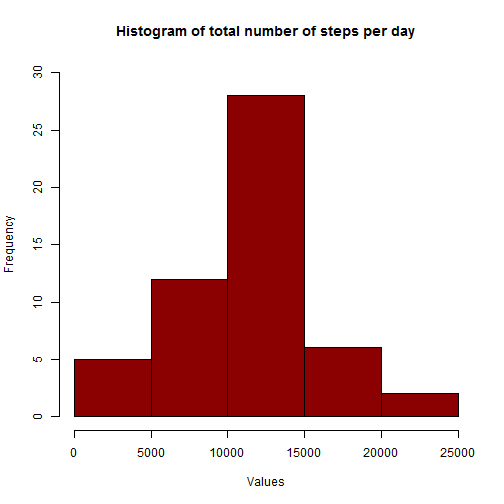
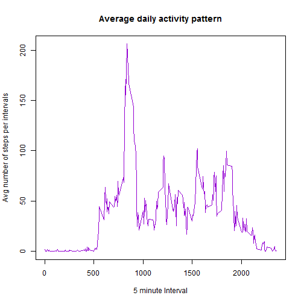
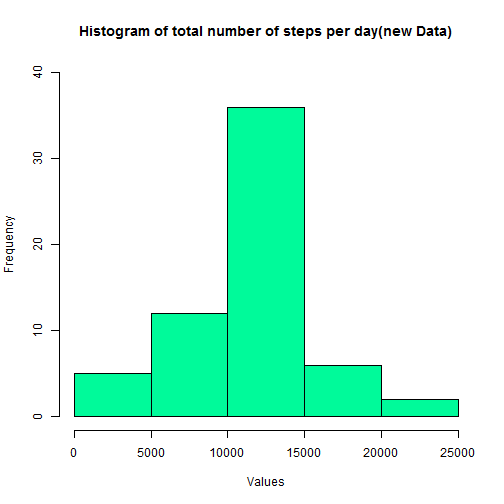

Reproducible Research: Peer Assessment 1
========================================

Rahul Janardan


## Overview

This analysis makes use of data from a personal activity monitoring device. This device collects data at 5 minute intervals through out the day. The data consists of two months of data from an anonymous individual collected during the months of October and November, 2012 and include the number of steps taken in 5 minute intervals each day.

## Data
  
The variables included in this dataset are:

1. steps: Number of steps taking in a 5-minute interval (missing values are coded as NA)
2. date: The date on which the measurement was taken in YYYY-MM-DD format
3. interval: Identifier for the 5-minute interval in which measurement was taken


The dataset is stored in a comma-separated-value (CSV) file and there are a total of 17,568 observations in this dataset.

## Loading the data


```r
if(!file.exists("activity.csv"))
  unzip("activity.zip")
data <- read.csv("activity.csv")
```
## What is mean total number of steps taken per day?

For this analysis, we follow the below steps:

1. Summarise data for total number of steps per day
2. Plot histogram using the total values from above summary.
3. Calculate the mean and median of the total number of steps taken per day. 

It is to be noted that

* The *plyr* package is being used.
* For this analysis we will ignore the NA rows by using the na.omit function
* **Dates with NA rows are ignored** for mean and median calculations.


```r
if(!require(plyr)){
  install.packages("plyr")
  require(plyr)
}
```

```
## Loading required package: plyr
```

```r
dataNoNA <- na.omit(ddply(data,"date", summarise,totalSteps = sum(steps)))
hist(dataNoNA$totalSteps,main = "Histogram of total number of steps per day",
     xlab = "Values", ylim = c(0,30),col = "dark red")
```

 

### Mean and Median reports.


1. The mean of total number of steps is **1.0766 &times; 10<sup>4</sup>.**

2. The median of total number of steps is **10765.**


## What is the average daily activity pattern?

**Summarise the data according to the 5 minute intervals and generate a time series plot.**

```r
avgDap <- ddply(data,.(interval), summarise,Mean = mean(steps,na.rm = TRUE))
plot(avgDap[[1]],avgDap[[2]],type = "l", 
     xlab = "5 minute Interval", 
     ylab = "Avg number of steps per intervals", 
     main = "Average daily activity pattern",
     col = "darkviolet")
```

 

**Report the 5-minute interval that, on average, contains the maximum number of steps**


* The 5-minute interval that, on average, contains the maximum number of steps is **835.**


## Imputing missing values

**Reporting missing values in the data set**

* The total number of missing values in the data set is **2304.**

**Strategy for filling in missing values in the data set.**

The mean or median for a day may not be a good choice to replace as some days have completely NA filled in. A better approach would be to use the mean for that particular 5 minute interval.

Steps are as follows: 

1. Merge the raw data(stored in *data* data frame) with the *avgDap* data frame which has the interval-wise means. 
2. Since *merge* messes with the order of the list we will also reorder as per the date.
3. Now we use the *Mean*(of steps/interval) column to replace the NA values in the *steps* column. 


**Create new data set with missing data filled in**

```r
newData <- merge(data,avgDap,all.x = TRUE, sort = FALSE)
newData <- newData[order(newData$date),]
for(i in 1:length(newData$steps)){
    if(is.na(newData[i,2]))
      newData[i,2] <- newData[i,4]
}
newData <- newData[c(2,3,1)]
```

The **first 25 rows (ONLY)** of the new data set is as below: 


```r
kable(head(newData,25))
```

```
## 
## 
## |     |  steps|date       | interval|
## |:----|------:|:----------|--------:|
## |1    | 1.7170|2012-10-01 |        0|
## |63   | 0.3396|2012-10-01 |        5|
## |128  | 0.1321|2012-10-01 |       10|
## |205  | 0.1509|2012-10-01 |       15|
## |264  | 0.0755|2012-10-01 |       20|
## |327  | 2.0943|2012-10-01 |       25|
## |376  | 0.5283|2012-10-01 |       30|
## |481  | 0.8679|2012-10-01 |       35|
## |495  | 0.0000|2012-10-01 |       40|
## |552  | 1.4717|2012-10-01 |       45|
## |620  | 0.3019|2012-10-01 |       50|
## |716  | 0.1321|2012-10-01 |       55|
## |770  | 0.3208|2012-10-01 |      100|
## |840  | 0.6792|2012-10-01 |      105|
## |880  | 0.1509|2012-10-01 |      110|
## |924  | 0.3396|2012-10-01 |      115|
## |1018 | 0.0000|2012-10-01 |      120|
## |1097 | 1.1132|2012-10-01 |      125|
## |1141 | 1.8302|2012-10-01 |      130|
## |1183 | 0.1698|2012-10-01 |      135|
## |1230 | 0.1698|2012-10-01 |      140|
## |1320 | 0.3774|2012-10-01 |      145|
## |1388 | 0.2642|2012-10-01 |      150|
## |1443 | 0.0000|2012-10-01 |      155|
## |1507 | 0.0000|2012-10-01 |      200|
```
**Comparison of new data with original data for analysis**

First we will make a histogram after calculating the total number of steps using the new data. 

```r
newDataWithTotal <- ddply(newData,"date", summarise,totalSteps = sum(steps))
hist(newDataWithTotal$totalSteps,main = "Histogram of total number of steps per day(new Data)",
     xlab = "Values", ylim = c(0,40),col = "mediumspringgreen")
```

 

### Mean and Median reports 


1. The mean of total number of steps is **1.0766 &times; 10<sup>4</sup>.**

2. The median of total number of steps is **1.0766 &times; 10<sup>4</sup>.**

### Comparison and Impact

It can be seen when NA has been substituted with the  mean for that particular 5 minute interval there is no change in the mean(10766) but median without NA substitution was 10765 and after substitution is 10766. Hence the input of substitution strategy is minimal


## Are there differences in activity patterns between weekdays and weekends?

We will create a new column to the NA removed data set - newData - with just "weekday". Now wherever as per date it is a Saturday or a Sunday the value "Weekend" is substituted. We then convert the column to a factor. 

**Create weekend weekday factor variable column**


```r
newData$daytype <- "weekday"
newData[weekdays(as.Date(newData$date)) %in% c("Saturday","Sunday"),]$daytype <- "weekend"
newData$daytype <- as.factor(newData$daytype)
```
**Panel plot for weekend vs weekday data**


Create a data set with average number of steps taken in each interval averaged across all weekdays or weekends. Then use this to create a panel plot. 


```r
avgIntStepsByDayType <- ddply(newData,.(daytype,interval), summarize,Mean = mean(steps))
if(!require(lattice)){
  install.packages("lattice")
  require(lattice)
}
```

```
## Loading required package: lattice
```

```r
xyplot(Mean ~ interval | daytype,data = avgIntStepsByDayType,type = "l",
       layout = c(1,2),col = "blue1",ylab = "Number of steps", xlab = "Interval")
```

 

From the above plot it can be seen that there is a peak in the number of steps at around 835 interval in the weekend probably indicating a workout period. Even during weekend there is an increase in the number of steps at around this interval probably indicating a brief work out or probably just the early morning activities. Weekend number of steps from around the interval 1000 seems to be quite less. 
